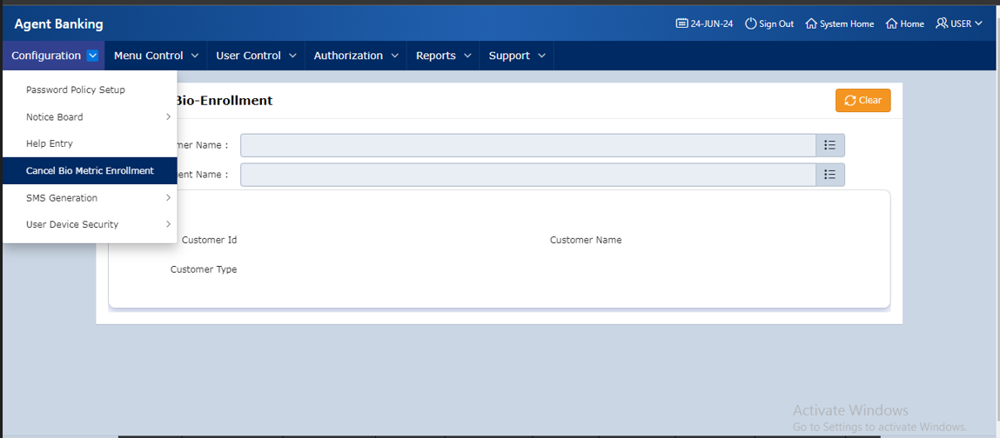
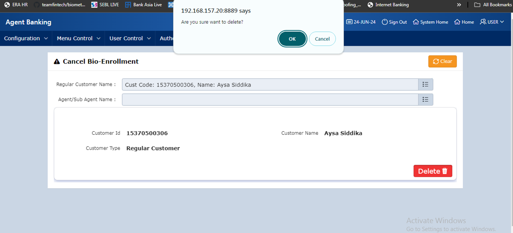
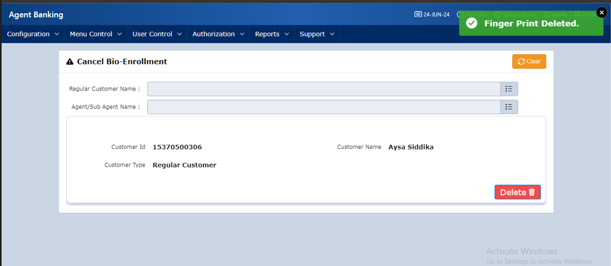

| Product Name | Product Version | Module Name | Feature Name | Update Date | Updated By
|---|---|---|---|---|---|
| eBiocore | 1.0 | Delete | Customer Bio Metric Delete (Finger Delete) | 26/06/2024 | Aysa Siddika

***

# Objective
If the customer finger is enrolled in new system then as per request of customer and back office user system will delete finger from biocore system usion delete API.

# Operations
Click delete button and confirm if you want to delete finger, after clicking OK delete API will be called and delete the finger from new system.

### Step -1
Go to system module and under configuration click on Cancel Bio Metric Enrollment Menu.

### Step-2
Select specific customer or agent then click delete button and confirm by clicking ok to delete the finger.

### Step-3
After successfully calling delete API finger deletion successful.

| Resource Name | Resource Type | Operation | Remarks | 
|---|---|---|---|
| TOKEN | API | GET | Get Access Token to call Verify API
| DELETE | API | POST | Delete finger in new system
| f106_page_143.sql | Apex Page | Delete Finger | Delete finger from new and old system.
|EMOB.CALL_BIOCORE_API | Package | Finger Delete API | Delete finger from new system

# Dependencies
Finger device drivers and ERA Biocore exe file.
