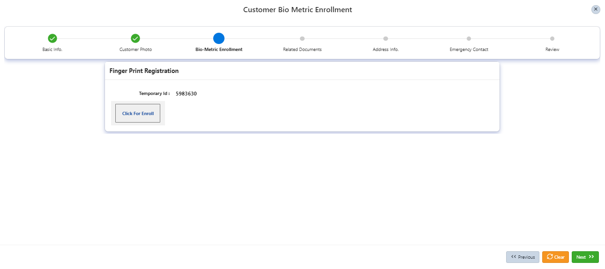
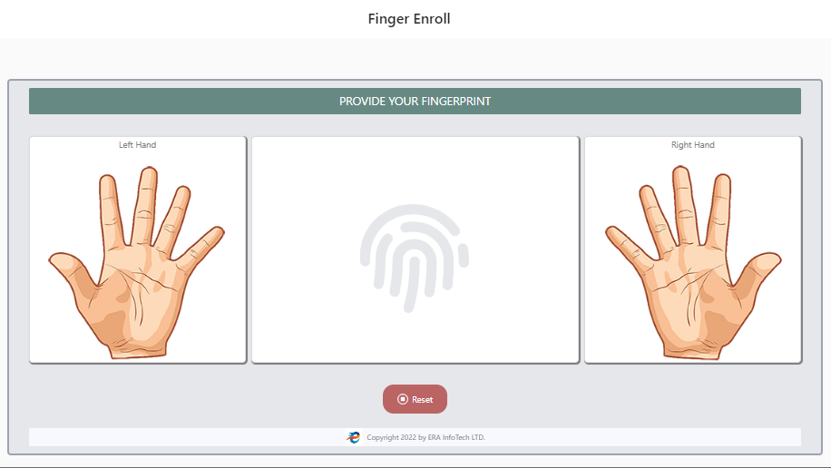
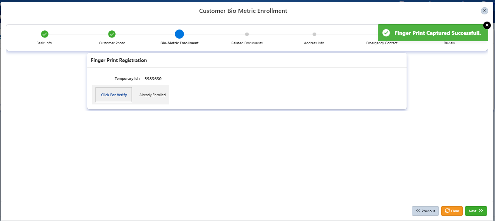

| Product Name | Product Version | Module Name | Feature Name | Update Date | Updated By
|---|---|---|---|---|---|
| eBiocore | 1.0 | Enroll | Customer Registration (Finger Enroll) | 24/06/2024 | Aysa Siddika

***

# Objective
If the customer point is setup to capture customer finger with new Biocore system then new widget will apear in customer finger enrollment.

# Operations
Click enroll buttom and new widget of Biocore will apear where customer one finger is mandatory, after capturing one finger and meet score 80 then system will automatically call enroll API to enroll the finger of the customer with raw data and iso template in new finger system.
### Step -1

### Step-2

### Step-3

| Resource Name | Resource Type | Operation | Remarks | 
|---|---|---|---|
| TOKEN | API | GET | Get Access Token to call Enroll API
| Enroll | API | POST | Enroll the customer in new system with online matching
| f106_page_81.sql | Apex Page | Capture Finger | Show the biocore widget to capture finger of customer
|f107_page_500.sql|Apex Page | Customer Creation | Customer point information getting
|f107_page_504.sql|Apex Page | Capture Customer Photo | Customer point information getting
|f107_page_505.sql|Apex Page | Finger Enroll | Customer point information getting and new or old finger enroll made available according to setup. 
# Dependencies
Finger device drivers and ERA Biocore exe file.

