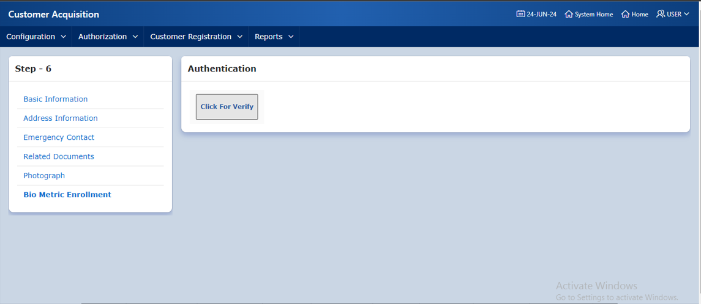
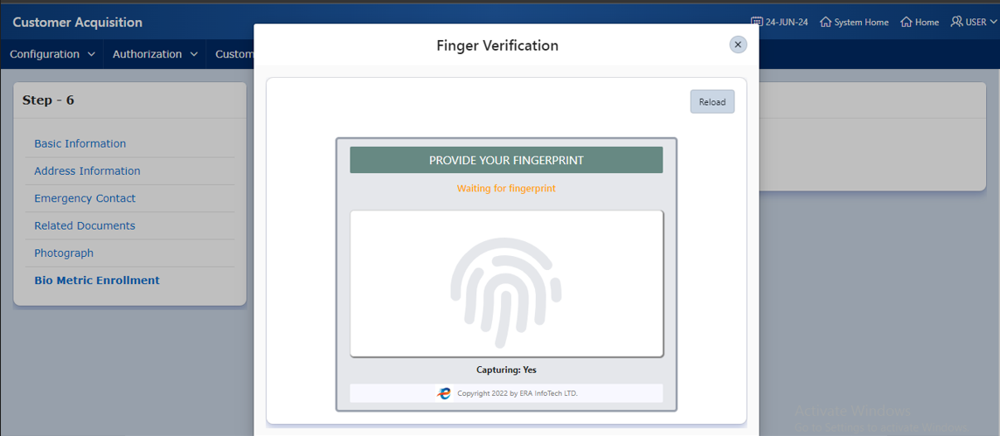
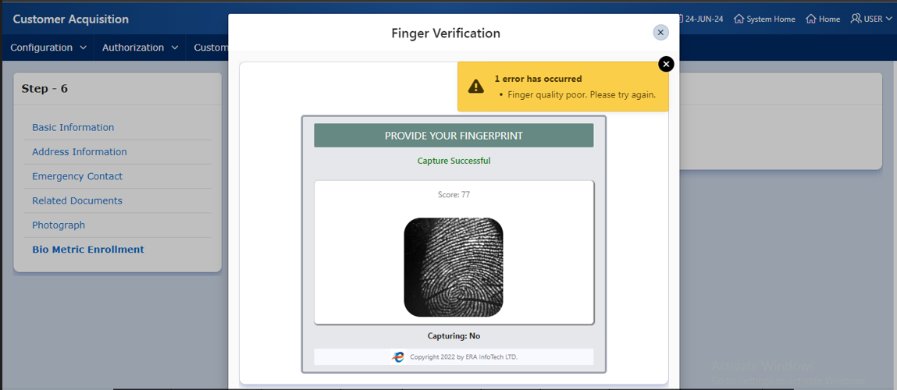
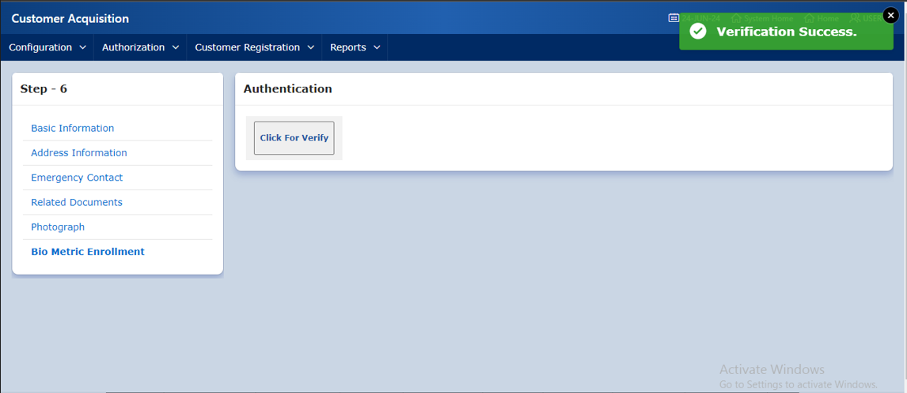

| Product Name | Product Version | Module Name | Feature Name | Update Date | Updated By
|---|---|---|---|---|---|
| eBiocore | 1.0 | Verify | Customer Change Information (Finger Verify) | 24/06/2024 | Aysa Siddika

***

# Objective
If the customer point is setup to capture customer finger with new Biocore system then new widget will apear in customer finger verification after enrollment.

# Operations
Click verify button and new widget of Biocore will apear where customer finger is mandatory, after capturing one finger and meet score 80 then system will automatically call verify API to verify the finger of the customer with iso template in new finger system which was enrolled earlier.

### Step -1
Click Verify Button

### Step-2
Capture Finger To verify

### Step-3
Minimum Score for verify is set to 80

### Step-4
Click Reload button and Capture Finger To verify

### Step-5
After successfully verifying customer finger

| Resource Name | Resource Type | Operation | Remarks | 
|---|---|---|---|
| TOKEN | API | GET | Get Access Token to call Verify API
| Verify | API | POST | Verify the customer in new system with online matching
| f106_page_83.sql | Apex Page | Capture Finger | Show the biocore widget to capture finger of customer to verify
|f107_page_268.sql|Apex Page | Customer Creation | Customer point information getting
# Dependencies
Finger device drivers and ERA Biocore exe file.
