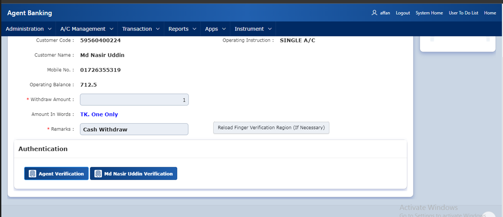
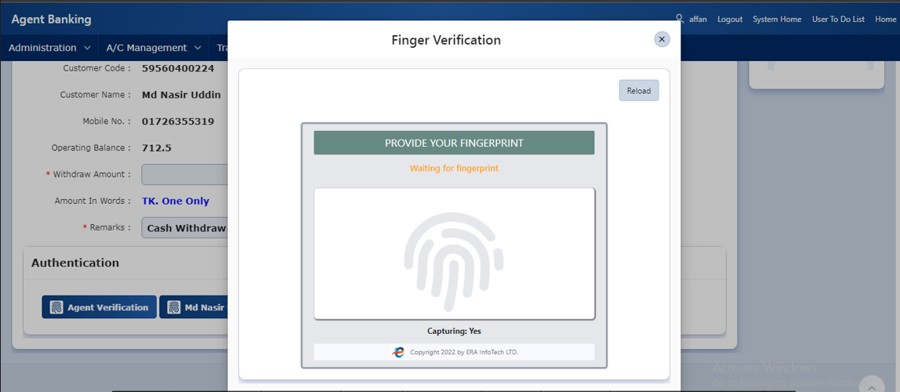
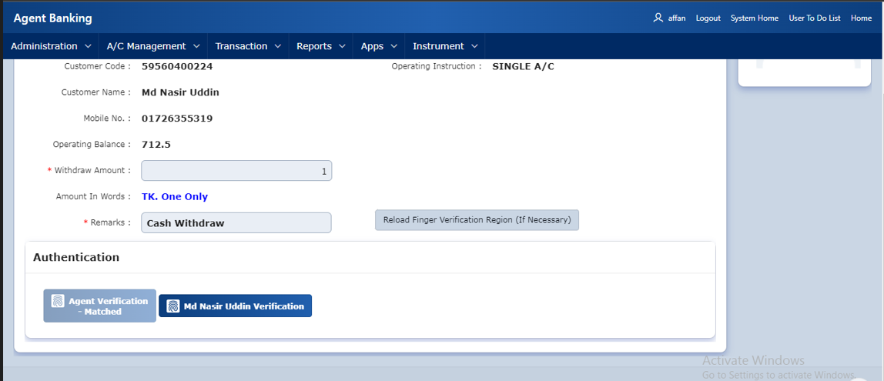

| Product Name | Product Version | Module Name | Feature Name | Update Date | Updated By
|---|---|---|---|---|---|
| eBiocore | 1.0 | Verify | Transaction Module | 24/06/2024 | Aysa Siddika

***

# Objective
If the customer point is setup to capture customer finger with new Biocore system then new widget will apear in all transactinal module.

# Operations
Click verify button and new widget of Biocore will apear where customer finger is mandatory, after capturing one finger and meet score 80 then system will automatically call verify API to verify the finger of the customer with iso template in new finger system which was enrolled earlier.

### Step -1
Click Verify Button with customer name

### Step-2
Capture Finger To verify

### Step-3
Successfully verified

| Resource Name | Resource Type | Operation | Remarks | 
|---|---|---|---|
| TOKEN | API | GET | Get Access Token to call Verify API
| Verify | API | POST | Verify the customer in new system with online matching
| EMOB.DPK_FIN_VERIFICATION_NEW | Package | Finger show | Finger showing process
| EMOIB.DPK_FIN_VERIFICATION_NEW | Package | Finger show | Finger showing process
|EMOB.AGENT_TRANSACTION_2FA.CUST_AGNT_VERIFICATION_SHOW | Package | Finger show | Finger showing process for 2FA
|EMOB.PKG_VALIDATION.PRC_CUST_VALIDATION|  Package | Finger checking | Customer review
|EMOB.CALL_BIOCORE_API | Package | API Calling | New system API call 
| EMOB.CAP_OTP_BIOCORE | Procedure | OTP | 2FA for re-enroll
| BIOTPL.DFN_PROCESS_FINGER_DATA_BIOCORE | Procedure | Transactional | Insert finger record after successful transaction
 | BIOTPL.DFN_PROCESS_FINGER_DATA_UNSUCESS_BIOCORE | Procedure | Transactional | Insert finger record after unsuccessful transaction
| f102_page_262.sql | Apex Page | Cash Withdraw | Show the biocore widget to capture finger of customer to verify
| f106_page_51.sql|Apex Page | Finger verify | Old verification system

# Dependencies
Finger device drivers and ERA Biocore exe file.
