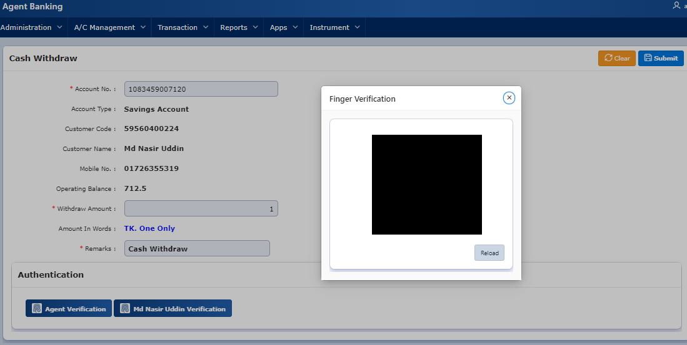
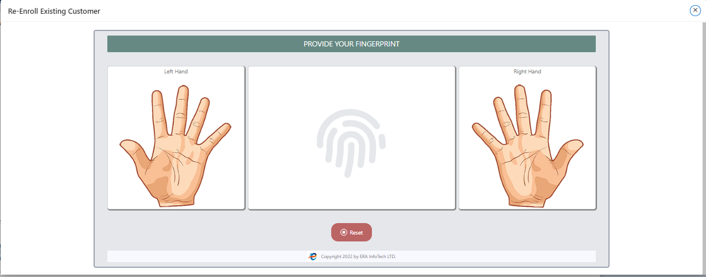
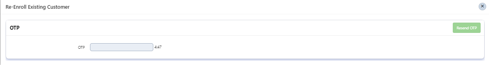
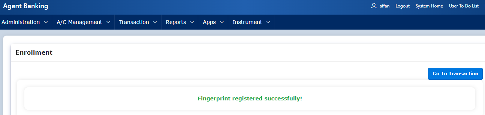

| Product Name | Product Version | Module Name | Feature Name | Update Date | Updated By
|---|---|---|---|---|---|
| eBiocore | 1.0 | Delete | Customer Bio Metric Migration | 01/07/2024 | Aysa Siddika

***

# Objective
Old system customer finger data migrate to new system after verification with OTP & old finger.
# Operations
Click verify button and give finger of customer. After verification of finger new enroll widget will open. Customer will give finger again and after second time verification OTP will be sent to Customer and after giving OTP customer finger will be enrolled in new system.

### Step -1
Go to cash withdraw and click on verify customer finger.

### Step-2
After verification of old customer new Enroll widget will open.

### Step-3
After successfully verifying the finger second time OTP will be sent.

### Step-4
After giving OTP and successfully calling ENROLL API finger enroll successful.

| Resource Name | Resource Type | Operation | Remarks | 
|---|---|---|---|
| TOKEN | API | GET | Get Access Token to call Verify API
| VERIFY | API | POST | Verify finger in old system
|ENROLL | API |  POST | Enroll finger in new system
| f102_page_262.sql | Apex Page | Cash Withdraw | Migrate finger from old to new system.
| f105_page_262.sql | Apex Page | Cash Withdraw | Migrate finger from old to new system.
| f102_page_324.sql | Apex Page | Cash Withdraw | Migrate finger from old to new system.
| f102_page_328.sql | Apex Page | Cash Withdraw | Migrate finger from old to new system.

# Dependencies
Finger device drivers and ERA Biocore exe file.
